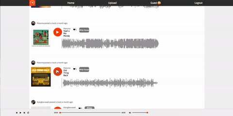

# Awaaz

[Awaaz][heroku]

[heroku]: https://awaaz.herokuapp.com/#/

Awaaz is a full stack website based on SoundCloud. It uses React.js on the front-end along with a Redux store of state, a PostgreSQL database and Ruby on Rails to handle the backend. It allows song and comments CRUD.

## Features and Implementation

### Continuous play

Like SoundCloud, Awaaz allows you to keep listening to the song no matter where you are on the site. Furthermore, it will change the queue depending on whether you select a song from the stream or a user show-page. This was accomplished through an audio slice of state, which relied on a single audio tag in the Audio Player component.

The default state of my audio reducer is as follows:

```js
const initialState = {
  currentTrackId: undefined,
  status: '',
  queue: []
};
```
### Setting the queue

The current trackId was defined by the queue, which depended on where on the site one navigates to; the currentTrackId is set once the play button is clicked.
I accomplished this through a setQueue method on my stream-index, which dispatched a set queue action, as follows:

```js
export const setQueue = (songs, currentTrackId) => {
  const queue = [];

  if ( songs instanceof Array) {
    songs.reverse().forEach((song) => {
      if (song.id <= currentTrackId) {
        queue.push(song.id);
      }
    });
  } else {
    queue.push(songs.id);
  }


  return({
    type: SET_QUEUE,
    queue
  });
};
```
### Waveforms

This was perhaps the most technically challenging part of my web application. Getting the waveforms up was not too difficult, but updating it's position when leaving a page and going to another page was difficult. The problem was that I could update the position of my audio player if I clicked on a certain location on the waveform, but not the other way round. This was because the waveform component itself had no idea about the state.

I overcame this hurdle through having the time of the current track as a slice of state that I passed into my waveform through the following code:

```js
componentWillReceiveProps(newProps) {
  const audio = document.getElementById("audio");
  if (newProps.status === "playing" && newProps.currentTrack === newProps.song.id && newProps.time) {
this.setState({playing: true, volume: 0, pos: newProps.time});
} else if (newProps.status === "paused" && newProps.currentTrack === newProps.song.id) {
this.setState({playing: false, volume: 0, pos: audio.currentTime});
}
else if (newProps.status === "playing" && newProps.currentTrack != newProps.song.id) {
    this.setState({playing: false, volume: 0, pos: 0});
}
}
````




### Footer Playbar

The progress bar was another interesting challenge. My default state for the audio player was as follows:

```js
this.state = {
  elapsedTime: 0,
  totalTime: 0
};
```
Through this, I had to handle two features of the bar; make the progress proportional the elapsedTime / totalTime, and parse it to display the time in MM:SS format. I had a parsing time function, and applied react in-line styling for the width of the progress div element, which depended on elapsedTime.


## Future directions for the project

### Search

I would like to implement the ability to search for users and songs. I feel it is crucial to the theme of the app being a social music sharing app.

### ~~Waveforms~~ Completed

~~I feel the waveforms are crucial for the visuals of the site. It is also what makes SoundCloud a unique web application, and it is worth pursuing.~~

### Likes and Follows

Again, the social theme of SoundCloud makes it great. I would like Awaaz to have the ability to allow users to follow each other, and like each others uploaded songs.
